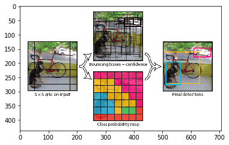
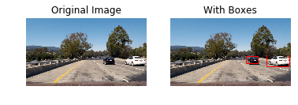
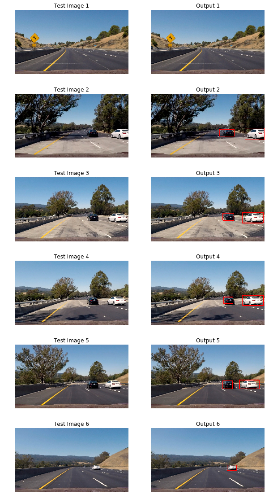

Here I've used the algorithm called YOLO. [https://pjreddie.com/darknet/yolo/] to try to maintain all the rubic point [https://review.udacity.com/#!/rubrics/513/view] just try some different techniques other than HOG+SVM.

### Brief Intro

Traditional, computer vision technique based, approaches for object detection systems repurpose classifiers to perform detection. To detect an object, these systems take a classifier for that object and evaluate it at various locations and scales in a test image. Systems like deformable parts models (DPM) use a sliding window approach where the classifier is run at evenly spaced locations over the entire image.

Other approaaches like R-CNN use region proposal methods to first generate potential bounding boxes in an image and then run a classifier on these proposed boxes. After classification, post-processing is used to refine the bounding boxes, eliminate duplicate detections, and rescore the boxes based on other objects in the scene. These complex pipelines are slow and hard to optimize because each individual component must be trained separately.

YOLO reframes object detection as a single regression problem, straight from image pixels to bounding box coordinates and class probabilities. A single convolutional network simultaneously predicts multiple bounding boxes and class probabilities for those boxes. YOLO trains on full images and directly optimizes detection performance.

In this project we will implement tiny-YOLO v1. Full details of the network, training and implementation are available in the paper - http://arxiv.org/abs/1506.02640

### Implementation

YOLO divides the input image into an SxS grid. If the center of an object falls into a grid cell, that grid cell is responsible for detecting that object. Each grid cell predicts B bounding boxes and confidence scores for those boxes.

Confidence is defined as (Probability that the grid cell contains an object) multiplied by (Intersection over union of predicted bounding box over the ground truth). Or

Confidence = Pr(Object) x IOU_truth_pred.                                                      
    (1)

If no object exists in that cell, the confidence scores should be zero. Otherwise we want the confidence score to equal the intersection over union (IOU) between the predicted box and the ground truth.

Each bounding box consists of 5 predictions:

1. x
2. y
3. w
4. h
5. confidence

The (x; y) coordinates represent the center of the box relative to the bounds of the grid cell. The width and height are predicted relative to the whole image. Finally the confidence prediction represents the IOU between the predicted box and any ground truth box.

Each grid cell also predicts C conditional class probabilities, Pr(ClassijObject). These probabilities are conditioned on the grid cell containing an object. We only predict one set of class probabilities per grid cell, regardless of the number of boxes B.

At test time we multiply the conditional class probabilities and the individual box confidence predictions,

Pr(Class|Object) x Pr(Object) x IOU_truth_pred = Pr(Class) x IOU_truth_pred                    
    (2)

which gives us class-specific confidence scores for each box. These scores encode both the probability of that class appearing in the box and how well the predicted box fits the object.

So at test time, the final output vector for each image is a S x S x (B x 5 + C) length vector

## The Model

### Architecture

The model architecture consists of 9 convolutional layers, followed by 3 fully connected layers. Each convolutional layer is followed by a Leaky RELU activation function, with alpha of 0.1. The first 6 convolutional layers also have a 2x2 max pooling layers.

### Pre-processing

#### Area of interest, cropping and resizing

Input to the model is a batch of 448x448 images. So we first determine the area of interest for each image. We only consider this portion of the image for prediction, since cars won't be present all over the image, just on the roads in the lower portion of the image. Then this cropped image is resized to a 448x448 image.

#### Normalization

Each image pixel is normalized to have values between -1 and 1. We use simple min-max normalization to achieve this.

### Output

The model was trained on PASCAL VOC dataset. We use S = 7, B = 2. PASCAL VOC has 20 labelled classes so C = 20. So our final prediction, for each input image, is:

    output tensor length = S x S x (B x 5 + C)

    output tensor length = 7 x 7 x (2x5 + 20)

    output tensor length = 1470.

The structure of the 1470 length tensor is as follows:

1. First 980 values correspons to probabilities for each of the 20 classes for each grid cell. These probabilities are conditioned on objects being present in each grid cell.
2. The next 98 values are confidence scores for 2 bounding boxes predicted by each grid cells.
3. The next 392 values are co-ordinates (x, y, w, h) for 2 bounding boxes per grid cell.

### Training

I have used pre-trained weights for this project. Training is done in 2 parts

#### Part 1: Training for classification

This model was trained on ImageNet 1000-class classification dataset. For this we take the first 6 convolutional layers followed by a followed by a fully connected layer.

#### Part 2: Training for detection

The model is then converted for detection. This is done by adding 3 convolutional layers and 3 fully connected layers. The modified model is then trained on PASCAL VOC detection dataset.

The pre-trained weights for this model (180 MB) are available in my github repository.

    

### Post Processing

As you can see in the above image, each input image is divided into an S x S grid and for each grid cell, our model predicts B bounding boxes and C confidence scores. There is a fair amount of post-processing involved to arrive at the final bounding boxes based on the model's predictions.

#### Class score threshold

We reject output from grid cells below a certain threshold (0.2) of class scores (equation 2), computed at test time.

#### Reject overlapping (duplicate) bounding boxes

If multiple bounding boxes, for each class overlap and have an IOU of more than 0.4 (intersecting area is 40% of union area of boxes), then we keep the box with the highest class score and reject the other box(es).

### Areas of Improvement

#### Simpler Network

The current frame rate is close to 0.6 frames per second. To be close to real time output we need atleast 30 frames per second. We have used a pre-train YOLO v1 network. This network is designed to detect 20 object classes. We could design and train a smaller network to work only on 1 object class (cars). This will reduce time required for forward pass.
